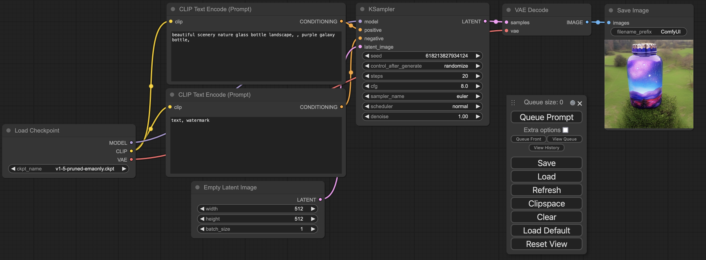

<h1>ComfyUI (NVIDIA) Docker</h1>

[ComfyUI](https://github.com/comfyanonymous/ComfyUI/tree/master) is an impressive diffusion WebUI. 
With the recent addition of a [Flux example](https://comfyanonymous.github.io/ComfyUI_examples/flux/), I created this container builder to test it.

- [1. Running the container](#1-running-the-container)
  - [1.1. First time use](#11-first-time-use)
- [2. Availability on DockerHub](#2-availability-on-dockerhub)
- [3. Unraid availability](#3-unraid-availability)
- [4. Screenshots](#4-screenshots)
  - [4.1. First run: Bottle image](#41-first-run-bottle-image)
  - [4.2. FLUX.1\[dev\] example](#42-flux1dev-example)
- [5. Building the container](#5-building-the-container)
  - [Nvidia base container](#nvidia-base-container)

<h2>Preamble</h2>

The `Makefile` will attempt to find the latest published release on GitHub and automatically propose to build this version.
It is also possible to manually set the version, by modifying the `Makefile` and adapting the `COMFY_VERSION` variable. 

This build is also set to not run internally as the `root` user, but run the requested UID/GID at `docker run` time.
This is done to a allow end users to have local directory structures for all the side data (input, output, temp, user), Hugging Face `HF_HOME` if used, and the entire `models` being separate from the running container and able to be altered by the user.

The tag for the ComfyUI container image is obtained from the latest official release from GitHub.
The tag for the base image is based on Today's date.
Note that a `docker buildx prune -f` might be needed to force a clean build after removing already existing containers.

To request a different UID/GID at run time use the `WANTED_UID` and `WANTED_GID` environment variables when calling the container.

Note: 
- for details on how to set up a Docker to support an NVIDIA GPU on an Ubuntu 24.04 system, please see [Setting up NVIDIA docker & podman (Ubuntu 24.04)](https://blg.gkr.one/20240404-u24_nvidia_docker_podman/)
- If you are new to ComfyUI, a recommended read: [ComfyUI_examples](https://comfyanonymous.github.io/ComfyUI_examples/)
- [ComfyUI FLUX examples](https://comfyanonymous.github.io/ComfyUI_examples/flux/)
- [FLUX.1[dev] with ComfyUI and Stability Matrix](https://blg.gkr.one/20240810-flux1dev/)
- [FLUX.1 LoRA training](https://blg.gkr.one/20240818-flux_lora_training/)

## 1. Running the container

In the directory where we intend to run the container, **create a `run` folder before running the container** (or give it another name, just be adapt the `-v` mapping in the `docker run` below). That `run` folder will be populated with a few sub-directories created with the UID/GID passed on the command line (see the command line below).

Among the folders that will be created within `run` are `HF, data/{input,output,temp}, user, models, custom_nodes, comfy_extras`

**The initialization script (run at each restart of the container) will do its best to not overwrite existing files (keeping the most recent -- if you are modifying an existing file, it might be safer to rename it; if a new version appears on Comfy's GitHub, your version might get erased) or remove files that are already in the destination.**

To run the container on an NVIDIA GPU, mounting the specified directory, exposing the port 8188 (change this by altering the `-p local:container` port mapping) and passing the calling user's UID and GID to the container:

```bash
docker run --rm -it --runtime nvidia --gpus all -v `pwd`/run:/comfy/mnt -e WANTED_UID=`id -u` -e WANTED_GID=`id -g` -p 8188:8188 mmartial/comfyui-nvidia-docker:latest
```

### 1.1. First time use

The first time you run the container, going to the IP of our host on port 8188 (likely http://127.0.0.1:8188), we will see the latest run or the bottle generating example.

This example requires the `v1-5-pruned-emaonly.ckpt` file.

It is available for example at https://huggingface.co/runwayml/stable-diffusion-v1-5/resolve/main/v1-5-pruned-emaonly.ckpt

The way to get the WebUI to see if is to first put it in the `models/checkpoints` folder:

```bash
cd <YOUR_RUN_DIRECTORY>/models/checkpoints
wget https://huggingface.co/runwayml/stable-diffusion-v1-5/resolve/main/v1-5-pruned-emaonly.ckpt
```

After the download is complete, click "Refresh" on the WebUI and "Queue Prompt"

Depending on the workflow, and the needed files by the different nodes, some can be found on [HuggingFace](https://huggingface.co/) or [CivitAI](https://civitai.com/).

For example, for checkpoints, those would go in the `run/models/checkpoints` directory (the UI might need a click on the "Refresh" button to find those) before a "Queue Prompt". 
Clicking on the model's filename in the "Checkpoint Loader" will show the list of available files in that folder.

## 2. Availability on DockerHub

Builds are available on DockerHub:
- [mmartial/comfyui-nvidia-docker](https://hub.docker.com/r/mmartial/comfyui-nvidia-docker), the ComfyUI pre-built image generated from the file in this repository's `Dockerfile`.
- [mmartial/comfyui-nvidia-base](https://hub.docker.com/r/mmartial/comfyui-nvidia-base), the base container that is used by the ComfyUI image. This image is published as it can be useful being a Ubuntu 22.04 with Nvidia components installed. For details on what is incorporated, please see the `Dockerfile-base` file.

## 3. Unraid availability

The container has been tested on Unraid.
I will update this when it has been added to the Community Apps.

## 4. Screenshots

### 4.1. First run: Bottle image



### 4.2. FLUX.1[dev] example

Template at [Flux example](https://comfyanonymous.github.io/ComfyUI_examples/flux/)


## 5. Building the container

The `comfyui-nvidia-base` (`base`) image contains the prerequisites to enable a ComfyUI installation from its latest release from GitHub.

The `comfyui-nvidia-docker` (`local`) image contains the installation of the core components of ComfyUI from its latest release from GitHub. 

Running `make` will show us the different build options; `local` is the one most people will want.

Run:
```bash
make local
```

The "base" image uses `Dockerfile-base` while the final image `Dockerfile`.
Feel free to modify either as needed.

### Nvidia base container

Note that the original `Dockerfile` `FROM` is from Nvidia, as such:

```
This container image and its contents are governed by the NVIDIA Deep Learning Container License.
By pulling and using the container, you accept the terms and conditions of this license:
https://developer.nvidia.com/ngc/nvidia-deep-learning-container-license
```